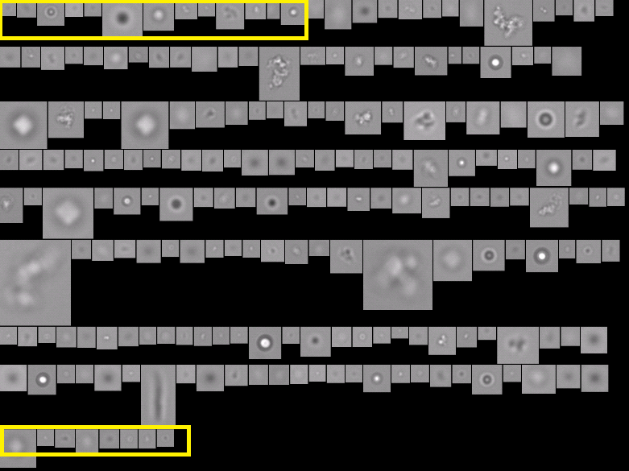

# flowimaging_splitter
Split flow imaging microscopes (FlowCam and FlowCam nano) collage images into a single image.
OpenCV based algorithm assigned same particle ID which FlowCam and FlowCam Nano software assigned during particle detection in real time.

Yellow --> Algorithm starts
Red --> Algorithm ends

