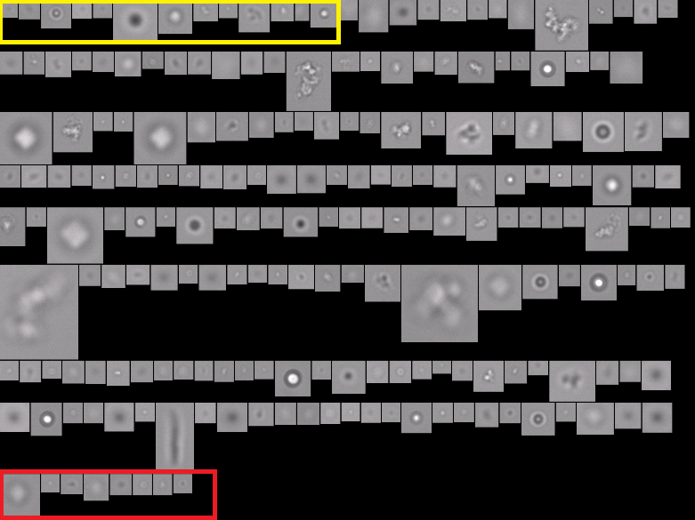

# flowimaging_splitter
Split flow imaging microscopes (FlowCam and FlowCam nano) collage images into a single image.
OpenCV based algorithm assigned same particle ID which instrument software assigned during particle detection in real time.

This algorithm is designed to combine machine learning results with morphological information dervied from instruments to better classify subvisible particles in proteins therapeutics.

- Yellow --> Algorithm starts from left top
- Red --> Algorithm ends at bottom right

